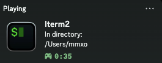

[](https://github.com/qwertyquerty/pypresence)

# iTerm2 Discord Rich Presence

A Python script that integrates **iTerm2** with **Discord Rich Presence**. It displays your current working directory in Discord's activity status.



## Features
- Shows your current working directory in iTerm2 as your Discord activity
- Automatically updates when you change directories
- Runs in the background while iTerm2 is open
- Can be set to start automatically when iTerm2 launches

## Requirements
- **MacOs**
- **iterm2 terminal**
- **Python 3.9+**

### Install Dependencies
Run the following command in your terminal:
```sh
pip install -r dependencies.txt
```
OR
```sh
pip install iterm2 pypresence
```

## Usage
### Set up Discord Application
1. Go to [Discord Developer Portal](https://discord.com/developers/applications).
2. Make a new **Application**.
3. Change the **name** to **Iterm2**, and set the **image** provided in **images** directory.
4. Copy the **Application ID**.

### Modify Script with your Application Id
1. Open `DiscordRichPresence.py` in your favourite editor.
2. Paste your **Application ID** in the `applicationID` variable.
```sh
applicationID = ("paste your application id here")
```
3. Save the script.

### Set up iterm2 to run scripts
1. Open **iterm2** and go to **Preferences** (`Cmd + ,`).
2. Go to `General > Magic`.
3. Enable **Python API**.

### Running the Script Manually
1. Open **iterm2** and navigate to the `DiscordRichPresence.py` directory.
2. Open Discord.
3. Run the script by running command:
```sh
python DiscordRichPresence.py
OR
python3 DiscordRichPresence.py
```

### Starting the Script Automatically
To start the script **automatically** when iTerm2 launches:
1. In finder, go to `Macintosh HD > Users > your-username > Library > Application Support > iterm2 > Scripts > AutoLaunch`.
2. Copy and Paste `DiscordRichPresence.py` script here.
3. Close and reopen iterm2 to load the script.
4. If auto launch does not work, please visit [Iterm2 Running a Script](https://iterm2.com/python-api/tutorial/running.html?highlight=run#auto-run-scripts) for troubleshooting.


## Troubleshooting
- If Discord does not display your activity, ensure **"Share your Detected Activity with Others"** is enabled in **Discord Settings > Activity Privacy**.
- If the script crashes, check the output for errors and ensure all dependencies are installed.
- If you get an **event loop error**, ensure only one instance of the script is running at a time.

## Contributing
Feel free to fork this project and make improvements! Pull requests are welcome.

## Future Features Ideas
1. System details (CPU/RAM usage)
2. Keyboard shortcut to enable/disable rich presence
3. Auto reconnect when connection lost


